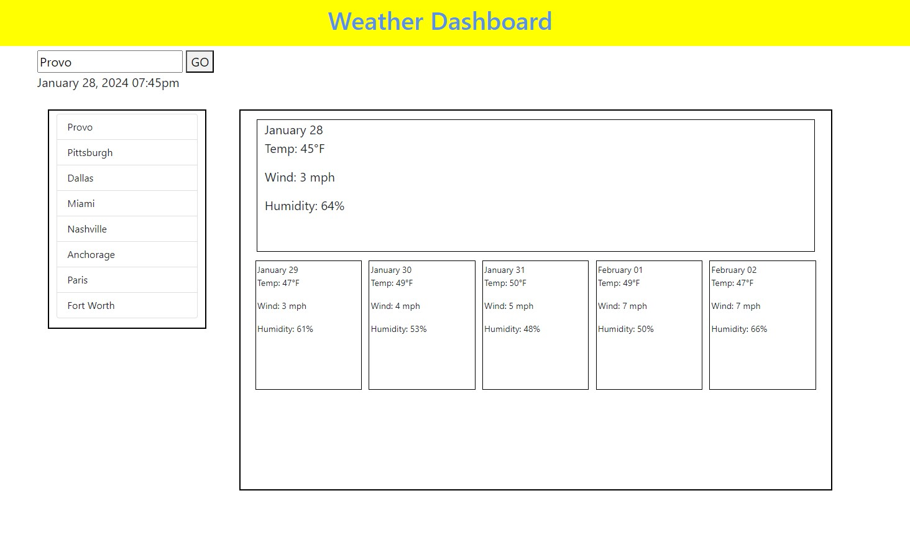

# WeatherTracker

## Description

This app is a 5 day weather Forecaster for any city entered.  Previous cities are also 
listed and clickable to display most current data.

## Installation

Run this app by navigating to https://carioto.github.io/WeatherTracker/

## Usage

Enter a city in the "Search City" box to display it's forecast for today 
and the next 5 days.  Use the cities list to revisted any of the last 8 cities.

## Credits

Sun icon by Icons8.  Assistant with icon image found at https://stackoverflow.com/questions/44177417/how-to-display-openweathermap-weather-icon.

